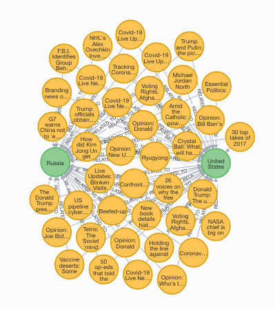
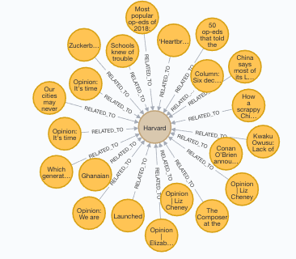
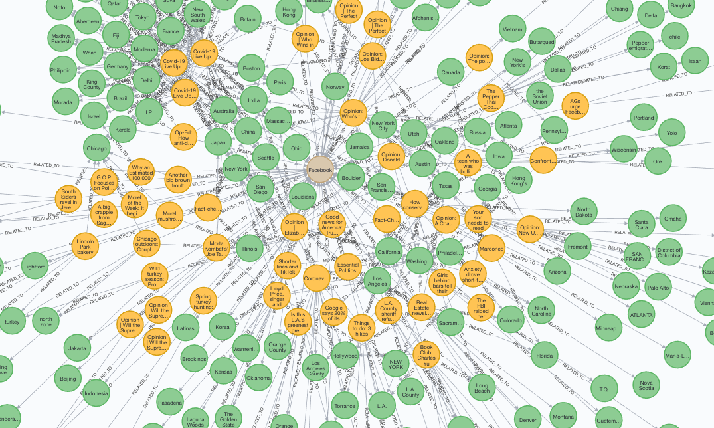

# Entity Network

This project attempts to do several things.  It will build a corpus of
news articles from various sources.  Every time you call the
`collect_data.py` program, it will go to the home page of several
national news sites and get a list of articles URLs.  Then, it will
get a sample of the URLs and check to see whether it has already
downloaded each URL.  If not, it will download the content and save it
to a JSON file in the `rawdata` directory.

A second program, called `process_story.py` will process all of the
stories.  Like `collect.data.py`, `process_story` will only fetch
stories that it has not seen before and will discard stories with an
empty story `text` as judged by the tool `newspaper`.  After fetching
the stories, it will store all of them in a Postgres database (called
`news`).  The `process_story.py` program will use the large English
model of Spacy to recognize Named Entities.

The Entities will be stored in an `entities` table related to the `news_items`
table through a third (join) table called `news_items_entities`.  The
`process_story.py` program will also use some state abbreviations and abbreviations
to the US to reduce the list of geographic entities.  It will use partial
matching to reduce the list of people entities.

Finally, a third program, called `process_graph.py` will create the
Neo4J graph of the story and entity database.

The Neo4J server as well as the Postgres server work through Docker.  You can
bring up both servers with the command: `docker-compose up`  You'll get an error
if you have a server running aready on ports 5432 (Postgres) or 7474 (Neo4J)
on the machine where you run this.  Also, I am running Python through a virtual
environment outside the Docker instance.

## Setup

Clone the project to a directory.  In one terminal, change to the new
directory (I'm assuming it is `entity_network`) and enter the following command:

```
cd entity_network
docker-compose up
```

In a separate terminal, change to the new directory and enter the
following commands:

```
cd entity_network
docker exec -i entity_network_db_1 psql -Upostgres < create_db.sql
docker exec -i entity_network_db_1 psql -Upostgres  news  < create_tables.sql
python collect_data.py
python process_story.py
python process_graph.py
```


After you do this, you will have a small graph database to play around
with.  As long as the Docker images are running, you can point your
browser to ```http://localhost:7474``` and you should be able to log
in.  The first time you log in you will be asked to change the
password for the user `neo4j`.  Please leave it at `neo4j`, since it
is used within the `process_graph.py` code.

Here are some example of queries and results I got with a data set of
more than 2000 stories.

```
match (us:GeoEntity {entity_name: "United States"}),
(ru:GeoEntity {entity_name: 'Russia'}),
(us)<-[:RELATED_TO]-(s:NewsItemNode)-[:RELATED_TO]->(ru)
return us, ru, s;
```

Stories mentioning both the United States and Russia.



```
match (n:OrgEntity {entity_name: 'Harvard'})<-[r:RELATED_TO]-(s) return n, r, s;

```

Stories mentioning Harvard




```
match (fb:OrgEntity {entity_name:"Facebook"})<-[r]-(s)-[r1]->(g:GeoEntity)
where g.entity_name <> "United States"
return fb,s,g
```

Stories mentioning Facebook and the geographic entities mentioned in
those stories that are not the United States.


